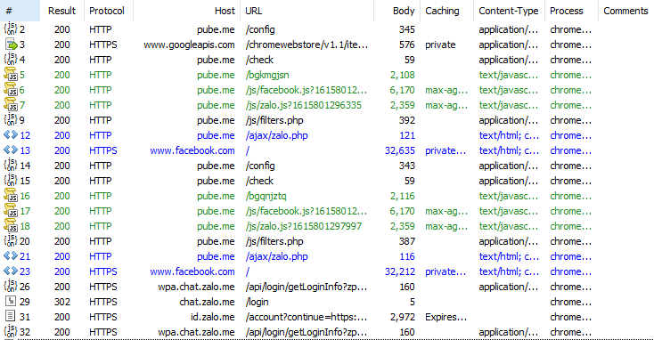
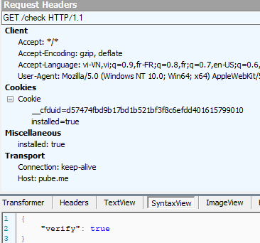

# Phân Tích trojan Profile Profile Visitor tận chân tơ kẽ tóc

Dạo này đây rộ lên một công cụ cho phép xem những người đã vào profile của mình bằng cách click vào phần mềm này thì lập tức có bài đăng trên trang cá nhân chia sẻ với người khác cùng cài.

Từ bài viết của bác [Đặng Thanh Tùng](https://www.facebook.com/groups/j2team.community/permalink/1525287414470040) trong nhóm J2TEAM Community mình sẽ khai thác sâu thêm vào các extension này sử dụng tài nguyên máy và điều khiển trình duyệt chrome như thế nào.

Đầu tiên xem xét qua về thư mục của extension này ta thấy có 3 file khá là kì lạ khi nó ko thuộc những file trong extension mà mình thường thấy. Thôi thì cứ để qua thư mục khác cho chắc cú. (file `config.json` cũng vậy luôn :P)

Mở file `manifest.json` thì đây là file kê khai mọi thứ mà chrome cần biết về extension và cần trỏ đúng vị trí. 

Cũng không có gì đặc sắc lắm ngoại từ nó yêu cầu chrome cấp quyền `"background"` cho nó. Quyền này với mục đích để yêu cầu chrome được chạy ngầm ngay cả khi nó được close. (Khum hiểu lấy tên `Google Gofoyih` để làm gì :()

File background thì có vẻ như nó đã được obfuscated ở mức độ nhẹ chỉ thay đổi hoàn toàn tên của variables và function names.

Khi chrome bắt đầu được chạy thì extension này sẽ gọi function `junkn()`:

`chrome.app` đã bị deprecated nhưng vẫn sử dụng được.
`chrome.app.getDetails()` để lấy toàn bộ info từ file `manifest.json`

Function này tiếp tục thực hiện fetch data từ `http://pube.me/config` và push vào object đã khởi tạo ở dòng đầu tiên. Nếu login == true thì thực hiện tiếp function `gjatf()`

Đến đoạn này đọc hơi mơ hồ nên mình sẽ load extension vào chrome luôn :) bật sẵn Fiddler 4 xem nó gửi nhận những request gì.

Oh shiet lắm vậy nhỉ =))))

Đầu tiên là file `/config` để ý thấy header cookie đã được set `installed=true` 

Có một điều khá là khác khi ta truy cập trực tiếp vào đường link `http://pube.me/config` trên trình duyệt thì dữ liệu trả về khá là khác, có thể là fake khi request này chỉ để lừa ga\` =))) khá là chắc kèo mấy thứ `hash`, `csrf`, `token` để đào coin.

Nhìn lại function `gjatf()`

Thì có vẻ như nó được fetch data lại với request header `{installed: true}`
Tiếp tục với request `http://pube.me/check` này thì `verify` xem có chả về true hay không.
Có thì thực hiện `vbgidd()` khum thì `mmexq()`.

Mình sẽ check lại fiddler trước.

Tiếp đến gọi function `vbgidd()`

fetch data từ request `http://pube.me/bgkmgjsn`, thử check fiddler xem

Thế là có một nùi thứ cần xem :D

Check từng dòng một xem 

Bắt đầu với function `run()` đã bắt sự kiện khi 1 tab đc update thì extension này sẽ check xem nếu người dùng mở `chrome://extensions` thì trang updated cuối cùng sẽ được load lại và push vào object `config` bao đầu.

Function `icon()` khá là buồn cười khi nó lại set cái icon extension thành hình settings (bánh răng cưa :D) khi click vào nó sẽ mở ra setting của chrome.

Function `counter()` để gửi 1 số info người dùng bao gồm cả trang web bạn vừa mới update :D và nó sẽ được gọi lại 5 phút một lần. 

Function `installed()` check xem chrome có lưu cookie của người dùng không sẽ lập tức call đến `getInstalledCookie()`

Đoạn trên này khá là vô bổ nên mình xin phép bỏ qua :( chủ yếu là để thu thập dữ liệu và thói quen của người dùng.

Phần hay ở sau khi nó còn load thêm 2 script ngoài có tên là `facebook.js` và `zalo.js` :D

Tạo hai thẻ script vào append vào backround của extension

Function `onRequest()` để bắt sự kiện khi trả về response HTTP/HTTPS của *facebook* hay *twitter* thì lập tức bị xóa bỏ CSP và bỏ qua ngăn chặn các trang tải khi trình duyệt phát hiện XSS. 

function `getfilter()` đã chặn kha khá các url khi người dùng truy cập vào. Nếu url có chứa `ext=me` thì mới được cho phép =)))) hài hước thật

Một số link từ facebook và twitter còn lại của các trang phần mềm anti-virus =)))) :D

Đến file `facebook.js`
Một số function mà bọn này đã lấy cắp thông tin từ phía các bạn:

- `getDtsg()` lấy dtsg, userid của các bạn từ facebook
- `getMobile()` lấy  encrypted token số điện thoại (cái này mình cũng không rõ họ decrypt kiểu gì)
- `getMessages()` lấy từ tin nhắn ra các thông tin của bạn bè và còn có thể là bạn bè của bạn bè :(
- `getToken()` lấy access token từ `business.facebook.com` gồm những quyền: *pages_read_engagement*, *pages_manage_metadata*, *pages_manage_ads*, *pages_manage_posts*, *pages_manage_engagement*
- `getUser()` và `createImage()` để tạo khung ảnh bao gồm ảnh của bạn và bạn bè của bạn thành 1 khung :D ví dụ như: 

- `getLocale()` lấy vị trí của bạn trên facebook
- `translate()` dịch ra các ngôn ngữ với thông điệp như các bài đăng trên facebook đó :> original: *Hello, you can see who visited your profile using the ProfileVisitor app*
- `postImage()` post ảnh đó lên newfeed của bạn và tag bạn bè zô :D
- `unfollowPost()` tắt thông báo của post đó.
- `hidePost()` ẩn post đó trên trang cá nhân của bạn :D

File `zalo.js`

- `loginInfo()` và `userInfo()` lấy info của bạn
- `getFriends()` lấy danh sách bạn bè bao gồm cả số điện thoại.
- `onlines()` lấy danh sash bạn bè đang online.
- `sendLink()` send link độc hại cho bạn bè.
- `addFriend()` add friend và nhắn tin với thằng ất ơ nào đó có id là *6189936972569385046*

Không loại trừ khả năng người tạo ra mã độc này là người Việt Nam nhé
Bài viết đến đây là hết cảm ơn mọi người đã đọc và phòng trách click vào link lại chạy những phần mềm không rõ nguồn gốc.

Còn 3 file update của windows mình cũng chưa biết để làm gì mong sẽ có bài viết phân tích. <3

Link exntesion cho các bác ngâm cứu thêm: [addons.zip](https://github.com/hypnguyen1209/profile-visitor-analyse/releases/download/lastest/addons.zip)